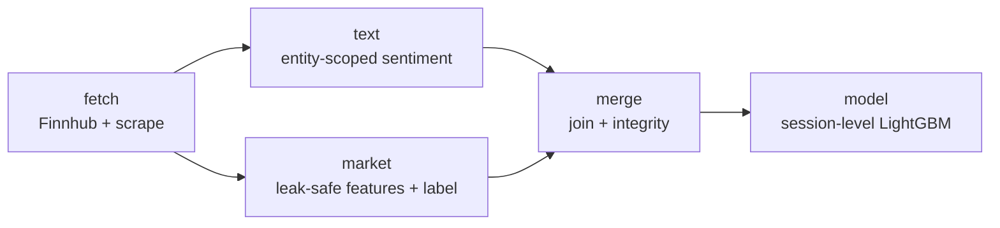

# stock-predictor

**Does financial-news sentiment predict a stock's next move?** An end-to-end research
pipeline that scores news sentiment *toward a specific company* (not in general) and tests
it against market returns across four tickers: TSLA, AAPL, AMZN, NVDA.

Built by Adam Wasiak and Kacper Kawecki. Python 3.12, `uv`, MIT-licensed.

## The finding

Article-level news sentiment does **not** predict next-session abnormal returns on these
tickers. Aggregated to the trading session, a tuned LightGBM classifier finds a real,
significant signal that survives a locked holdout, but it is narrow and largely
backward-looking:

| metric (locked holdout) | value |
|---|---|
| accuracy | 0.5798 (baseline 0.4309) |
| edge over baseline | +0.1489 |
| AUC | 0.6191 |
| McNemar p | 0.0019 |

The edge is carried by one company (AAPL); the sentiment signal correlates with the
*previous* session's return more than the next one. The full, evidence-backed record is in
[`reports/findings/4.0-final-findings.md`](reports/findings/4.0-final-findings.md) and the
[model card](reports/findings/model-card.md). The value of the project is the **text
layer**: entity-scoped sentiment with neural coreference and local-LLM referent
verification.

## Pipeline

Four ticker-agnostic layers that meet only at Parquet tables and the constants in
`config.py`, so no layer's construction can see another's.



- **text** (`stock_predictor/text/`) — the core. Splits article bodies into sentences,
  tags which are about the target company (explicit names plus neural coreference), scores
  each with FinBERT and an aspect-based model (ABSA) *toward that company*, then gates every
  coreference-resolved sentence through a local instruct-LLM (Qwen2.5-7B) that verifies the
  referent. Output: one feature row per article.
- **market** (`stock_predictor/market/`) — pre-publication features (momentum, volatility,
  beta, relative volume, earnings distance) and the abnormal-return label. Every feature is
  verified computable at publication time; a `momentum_1d` leakage regression runs on every
  merge.
- **merge** (`stock_predictor/merge/`) — joins the two tables per article, checks the key
  means one article everywhere, and pools the tickers on `(article_id, ticker)`.
- **model** (`stock_predictor/modeling/`, `features.py`) — a session-level LightGBM tuned
  through a walk-forward harness and a locked holdout. Ships as `models/session_model.joblib`.

## Setup

```bash
uv sync
```

Four things `uv sync` does not cover:

```bash
# 1. spaCy model (entity filter)
uv run python -m spacy download en_core_web_sm

# 2. Transformer weights (FinBERT + ABSA), pre-fetched to avoid a mid-run stall
uv run python -c "from transformers import AutoModelForSequenceClassification as M; \
  M.from_pretrained('ProsusAI/finbert'); M.from_pretrained('yangheng/deberta-v3-base-absa-v1.1')"
```

3. **Referent-verification judge** (optional): a 4-bit GGUF of Qwen2.5-7B-Instruct (~4.7 GB)
   at `models/gguf/Qwen2.5-7B-Instruct-Q4_K_M.gguf`. If absent, the judge stage is skipped
   and the corpus is left unverified rather than failing.
4. **Finnhub API key** for re-pulling the article feed: put `FINNHUB_API_KEY=...` in `.env`.

## Running

```bash
# Build the feature tables (per ticker, or --all)
uv run python -m stock_predictor.text.run_pipeline   TSLA
uv run python -m stock_predictor.market.run_pipeline --all
uv run python -m stock_predictor.merge.run_pipeline  --all

# Train and serialize the shipped model, then score new sessions
make train                                             # -> models/session_model.joblib
uv run python -m stock_predictor.modeling.predict INPUT.parquet

# Interactive text-layer demo: paste an article, see sentiment toward a company
uv run streamlit run app/streamlit_app.py
```

The text pipeline is resumable and cached; budget several hours from cold (the judge
dominates), or about 25 minutes with warm caches.

## Repository layout

```
stock_predictor/     source package
  text/              entity-scoped sentiment pipeline (the core)
  market/            pre-publication features + abnormal-return label
  merge/             join, integrity checks, pooling
  modeling/          train / predict the shipped model
  features.py        session-table builder + final model config
  config.py          central paths, constants, the company registry
app/                 Streamlit demo
notebooks/           the reasoning behind every decision, in pipeline order
  text/              2.0-2.3: sentence table -> referent -> score -> article table
  market/            price, calendar, feature construction
  modelling/         3.0-4.0: iterations, tuning, and the final findings record
reports/             generated analysis (fetch / market / merge / text / findings)
data/                see data/README.md for what is tracked and what rebuilds
tests/               pytest suite (run the fast subset with make test-fast)
```

## Documentation

- **Decisions and evidence** live in `notebooks/`, in pipeline order. The modelling arc runs
  `3.0` (EDA) through `3.7` (tuning) to `4.0` (final findings).
- **`reports/findings/`** — the final findings notebook's standalone report, the model card,
  and the momentum-leakage write-up.
- **`data/README.md`** — what each data directory holds, what is tracked, what rebuilding costs.

## Development

```bash
make lint         # ruff format --check + ruff check
make test-fast    # pytest -m "not slow"  (skips model/network tests)
make test         # full suite
make format       # ruff format + autofix
```

CI (`.github/workflows/ci.yml`) runs the lint and the fast tests on every push and PR.

## License

MIT. See [`LICENSE`](LICENSE).
