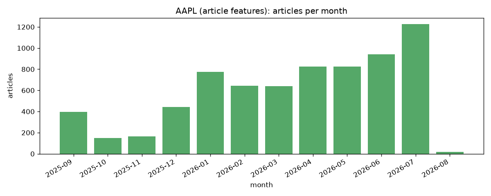
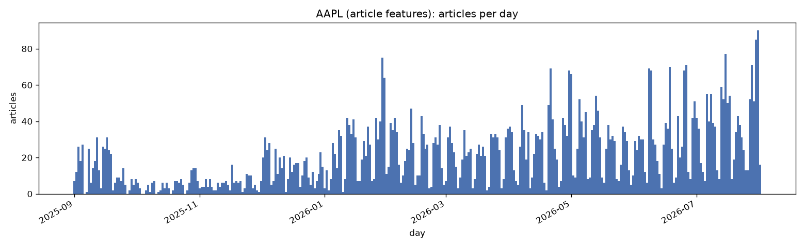

# `article_features.parquet`

One row per article, judge-gated. The final output of the text pipeline and the table a price model consumes.

**Rows:** 7,041 | **Columns:** 24 | **Span:** 2025-09-01 to 2026-08-01

Produced by `news_sentiment.text.run_pipeline`, Phase E. Every score is a fusion of FinBERT and DeBERTa ABSA at `CONF_FLOOR`; no raw probability triples and no provenance columns are carried. Sentences the referent judge rejected contribute to nothing here.

## Distribution over time

How the surviving rows fall across the span. This is the population a price model actually joins against, so it is the relevance filter and the judge gate already applied -- not the shape of the fetch, which `reports/{ticker}_*_fetch_report.md` covers. A month reading far below its neighbours here, on a corpus the fetch report shows as steady, means articles were dropped downstream rather than never collected.

| metric | value |
| --- | --- |
| articles | 7,041 |
| date span | 2025-09-01 to 2026-08-01 (335 days) |
| active days | 328 of 335 (97.9%) |
| longest gap | 2 consecutive days with no article |
| articles/day | min 0, median 16, max 90 |

## Identity

| column | type | description |
|---|---|---|
| `article_id` | int64 | Publisher-assigned identifier, unique per row. |
| `ticker` | str | The target company the features were computed for. |
| `timestamp_utc` | datetime64[us, UTC] | Publication time. The join key for the market layer. |
| `source` | str | Publisher name. |

## Features

`coverage` is the share of rows that are non-null. NaN means the population was empty, never that the score was zero.

| column | type | coverage | mean | std | description |
|---|---|---:|---:|---:|---|
| `n_total_sents` | int64 | 100.0% | 26.544 | 24.692 | Sentences in the article after splitting, excluding scraper residue. |
| `n_entity_sents` | int64 | 100.0% | 5.633 | 6.871 | Sentences tagged as being about the target, non-boilerplate. |
| `n_ceo_sents` | int64 | 100.0% | 0.067 | 0.333 | Sentences mentioning the CEO but not the target itself. |
| `n_boilerplate_sents` | int64 | 100.0% | 6.459 | 8.206 | Sentences whose exact text repeats across five or more articles. |
| `entity_share` | float64 | 100.0% | 0.269 | 0.275 | n_entity_sents over the article's non-boilerplate sentence count. |
| `article_length` | int64 | 100.0% | 4114.015 | 3208.708 | Characters in the article as published, boilerplate included. |
| `fus_conf_graft_floor_mean` | float64 | 100.0% | 0.054 | 0.150 | Mean fused score over the target sentences. |
| `fus_conf_graft_floor_median` | float64 | 100.0% | 0.116 | 0.390 | Median of the same population. Disagrees on sign with the mean on about a fifth of articles, so it detects skew. |
| `fus_conf_graft_floor_lead` | float64 | 100.0% | 0.075 | 0.345 | Mean over target sentences in the opening window only. 0.0, not NaN, when the window holds none. |
| `fus_conf_graft_floor_top3_pos` | float64 | 100.0% | 0.279 | 0.434 | Mean of the three highest sentence scores. Reads the tail rather than the centre. |
| `fus_conf_graft_floor_top3_neg` | float64 | 100.0% | -0.095 | 0.438 | Mean of the three lowest sentence scores. |
| `fus_conf_graft_floor_spread` | float64 | 100.0% | 0.374 | 0.515 | top3_pos minus top3_neg. Separates a contested article from a quiet one, which the mean cannot. |
| `fus_ceo_mean` | float64 | 20.7% | 0.061 | 0.419 | Mean fused score over CEO-only sentences. NaN where the article has none. |
| `has_ceo_mention` | bool | 100.0% |  |  | Whether the article has any CEO-only sentence (n_ceo_sents > 0). Robust to the headline-only 0-fill, unlike fus_ceo_mean.notna(). |
| `fus_headline` | float64 | 100.0% | 0.032 | 0.437 | The headline through both scorers, grafted. One string, one number. |
| `fus_maxmag` | float64 | 100.0% | 0.118 | 0.642 | Signed score of the single loudest target sentence, chosen by largest absolute fused score. |
| `fus_trusted_mean` | float64 | 100.0% | 0.052 | 0.149 | Mean fused score over the surface and coref_span channels only, excluding the weakest-measured channel. |
| `fus_scorer_gap` | float64 | 100.0% | 0.407 | 0.278 | Mean absolute difference between the two scorers over the target population. High means the article was contested between them. |
| `fus_headline_gap` | float64 | 100.0% | -0.022 | 0.412 | fus_headline minus the body mean. How far the headline leads or lags the article. |
| `fus_lead_gap` | float64 | 100.0% | 0.022 | 0.269 | The lead score minus the body mean. How far the opening leads or lags the rest. |

## Reading the columns

- **NaN over zero.** 0.0 is a real fused score, so an empty population is NaN rather than 0. The exception is `fus_conf_graft_floor_lead`, which is 0.0 when the opening window holds no target sentence: an article that does not mention the target early delivers no early sentiment, and that is a measurement.
- **Headline-only articles** keep their row with body scores filled to 0.0. They are identifiable by `n_entity_sents == 0`, and no other row has that, so the fill is reversible.
- **Sign** follows `pos - neg`: positive is favourable to the target.
- **Relevance.** Articles with no target sentence in the body and no target named in the headline are dropped, which is why the row count is below the corpus size.

Every design decision behind these columns is argued in `notebooks/text/2.2` and `notebooks/text/2.3`.
