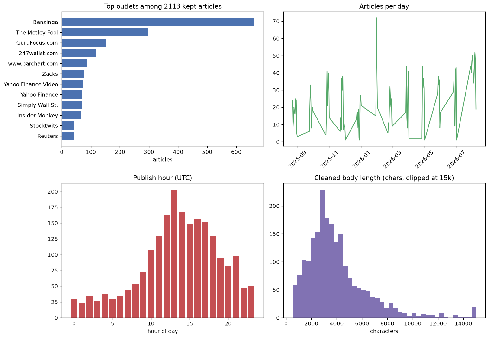

# Processed news corpus (notebook 1.2)

Generated 2026-08-13 21:00 UTC from the open-corpus run, read out of `data/processed/processed_articles.parquet`.

## 1. Overview

| metric | value |
| --- | --- |
| kept articles | 2,113 of 2,742 open (77.1%) |
| distinct outlets | 76 |
| date span | 2025-08-22 to 2026-08-07 (350 days, 95 with articles) |

## 2. Recovery and losses

How many pages come back depends on Yahoo's rate limiting at the time of the run, so it changes from run to run. A best run has no 429 in the losses, which means nothing was throttled and only the genuinely dead pages were lost.

| stage | count | rate |
| --- | --- | --- |
| open corpus | 2,742 | 100.0% |
| reached (200) | 2,441 | 89.0% |
| accepted (body) | 2,113 | 77.1% |
| lost | 629 | 22.9% |

Rejected by reason:

| reason | count |
| --- | --- |
| body failed | 328 |
| unreached | 301 |

Unreached by status (HTTP code or error kind):

| status | count |
| --- | --- |
| 404 | 234 |
| 403 | 56 |
| 401 | 5 |
| 406 | 4 |
| ConnectionError | 2 |

Time provenance among kept articles: 2,046 corrected from the page (96.8%), 67 held at the Finnhub API floor (3.2%).

Acceptance by raw source:

| source | tried | kept | rate |
| --- | --- | --- | --- |
| Benzinga | 451 | 450 | 99.8% |
| DowJones | 17 | 15 | 88.2% |
| Yahoo | 2,274 | 1,648 | 72.5% |

## 3. Sources

The single Yahoo label opens into 76 real outlets. Top 20 by count:

| outlet | articles |
| --- | --- |
| Benzinga | 661 |
| The Motley Fool | 296 |
| GuruFocus.com | 152 |
| 247wallst.com | 119 |
| www.barchart.com | 89 |
| Zacks | 76 |
| Yahoo Finance Video | 72 |
| Yahoo Finance | 71 |
| Simply Wall St. | 69 |
| Insider Monkey | 68 |
| Stocktwits | 42 |
| Reuters | 41 |
| Investing.com | 28 |
| TechCrunch | 26 |
| GlobeNewswire | 25 |
| Investopedia | 23 |
| StockStory | 20 |
| Investor's Business Daily | 19 |
| Quartz | 15 |
| Fortune | 15 |

...and 56 more outlets in the long tail.

## 4. Temporal coverage

| metric | value |
| --- | --- |
| active days | 95 of 350 in span |
| articles per active day | mean 22.2, median 20 |

Busiest days:

| day | articles |
| --- | --- |
| 2026-01-29 | 72 |
| 2026-08-05 | 52 |
| 2026-07-31 | 50 |
| 2026-07-30 | 47 |
| 2026-08-06 | 46 |

Publish hour (UTC), all kept articles:

| hour | articles |
| --- | --- |
| 00 | 30 |
| 01 | 24 |
| 02 | 34 |
| 03 | 27 |
| 04 | 38 |
| 05 | 29 |
| 06 | 34 |
| 07 | 44 |
| 08 | 53 |
| 09 | 72 |
| 10 | 108 |
| 11 | 130 |
| 12 | 163 |
| 13 | 203 |
| 14 | 167 |
| 15 | 149 |
| 16 | 156 |
| 17 | 152 |
| 18 | 129 |
| 19 | 94 |
| 20 | 82 |
| 21 | 98 |
| 22 | 47 |
| 23 | 50 |

## 5. Body length (characters)

| stat | chars |
| --- | --- |
| min | 509 |
| 25th pct | 2,422 |
| median | 3,441 |
| mean | 4,081 |
| 75th pct | 4,868 |
| max | 51,667 |

Share over 1,000 characters: 97.0%; over 3,000: 60.2%.

