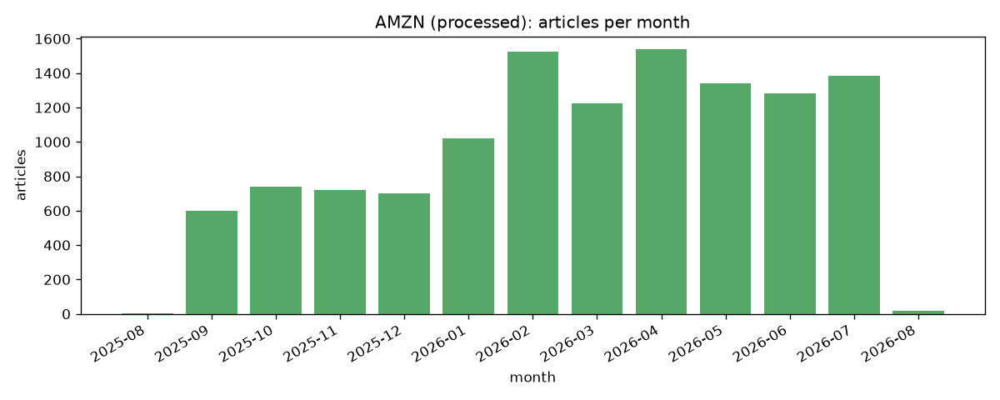
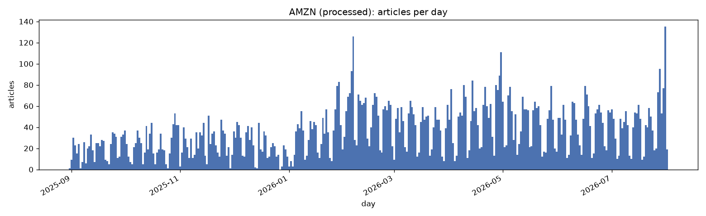

# AMZN fetch report (processed)

Generated 2026-08-28 14:26 UTC from 12,096 processed articles.

## 1. Overview

| metric | value |
| --- | --- |
| total articles | 12,096 |
| date span | 2025-08-31 to 2026-08-01 (336 days) |
| active days | 335 of 336 (99.7%) |
| longest gap | 1 consecutive days with no article |

## 2. Articles by month

| month | articles | active days |
| --- | --- | --- |
| 2025-08 | 1 | 1 of 1 |
| 2025-09 | 601 | 30 of 30 |
| 2025-10 | 739 | 31 of 31 |
| 2025-11 | 721 | 30 of 30 |
| 2025-12 | 700 | 30 of 31 |
| 2026-01 | 1,021 | 31 of 31 |
| 2026-02 | 1,524 | 28 of 28 |
| 2026-03 | 1,226 | 31 of 31 |
| 2026-04 | 1,537 | 30 of 30 |
| 2026-05 | 1,339 | 31 of 31 |
| 2026-06 | 1,284 | 30 of 30 |
| 2026-07 | 1,384 | 31 of 31 |
| 2026-08 | 19 | 1 of 1 |

## 3. Articles by day

min 0, median 34, max 135 articles/day.

## 4. Burst check

`company_news` caps results per call regardless of window width and fills most-recent-first, which is what a whole-month pull turns into a handful of tail-of-month bursts instead of a steady year -- first diagnosed on TSLA (`notebooks/modelling/3.0`, section 6) and the reason `pull_company_news` windows by day instead. There's no single active-day-share or gap-length number that applies across every ticker, since a genuinely low-news company (a control stock, say) will legitimately have fewer active days than a heavily-covered one, and that's real signal, not a bug. What to actually look for, in sections 1-2 above:

- **A repeated, flat monthly count.** If several months show close to the same article count despite covering different numbers of active days, that's the truncation signature -- the call is hitting a ceiling, not describing real volume. This corpus's monthly counts run from 1 to 1,537; genuine variation across that range is the healthy sign, a tight repeated band is not.
- **A long gap relative to the corpus span.** This pull's longest gap is 1 day(s) against a 336-day span. A gap that spans what should be active trading days, rather than a real quiet period for this specific company, is worth checking against the daily chart above.
- **A low active-day share is not evidence on its own.** This pull sits at 99.7%; whether that's healthy depends on how newsy the company actually is, not on matching another ticker's number.
