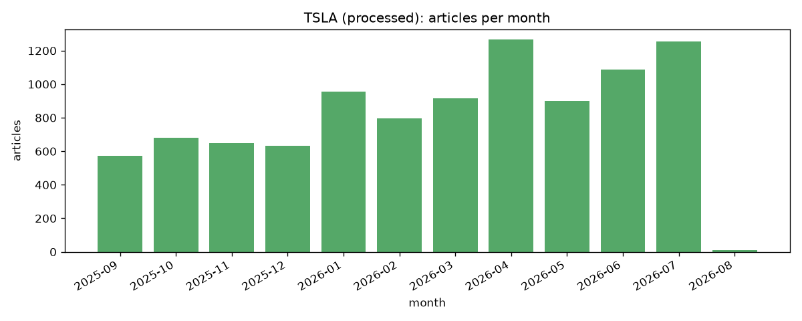
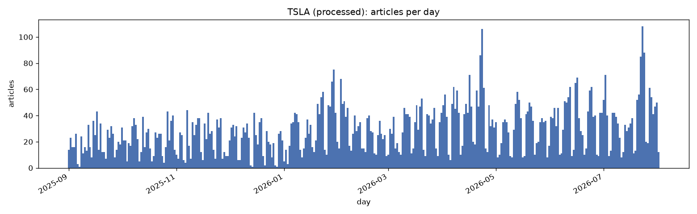

# TSLA fetch report (processed)

Generated 2026-08-27 20:48 UTC from 9,726 processed articles.

## 1. Overview

| metric | value |
| --- | --- |
| total articles | 9,726 |
| date span | 2025-09-01 to 2026-08-01 (335 days) |
| active days | 335 of 335 (100.0%) |
| longest gap | 0 consecutive days with no article |

## 2. Articles by month

| month | articles | active days |
| --- | --- | --- |
| 2025-09 | 573 | 30 of 30 |
| 2025-10 | 682 | 31 of 31 |
| 2025-11 | 650 | 30 of 30 |
| 2025-12 | 634 | 31 of 31 |
| 2026-01 | 955 | 31 of 31 |
| 2026-02 | 798 | 28 of 28 |
| 2026-03 | 915 | 31 of 31 |
| 2026-04 | 1,265 | 30 of 30 |
| 2026-05 | 901 | 31 of 31 |
| 2026-06 | 1,087 | 30 of 30 |
| 2026-07 | 1,254 | 31 of 31 |
| 2026-08 | 12 | 1 of 1 |

## 3. Articles by day

min 1, median 27, max 108 articles/day.

## 4. Burst check

The original Finnhub pull clustered into roughly 13 tail-of-month bursts: 92 of 351 days active (26.2%), gaps up to 27 days, traced to `company_news` capping results per call and backfilling from the most recent news first (`notebooks/modelling/3.0`, section 6). Section 1 and 2 above run the same check against this pull; a steady fetch reads as active-day share well above that 26.2% baseline and no gap anywhere near 27 days, with no month reading as a short tail-end burst in section 2.
