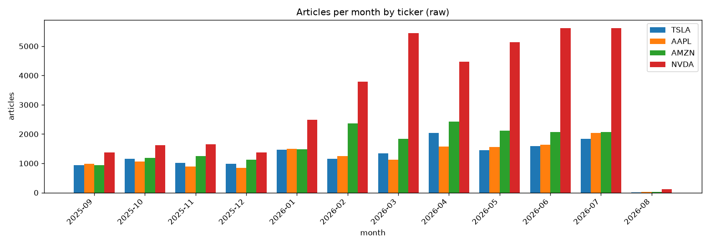
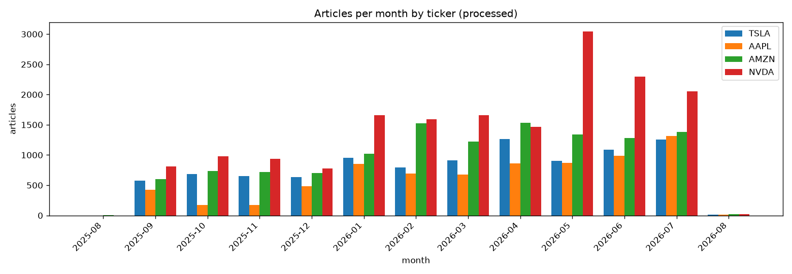

# Cross-ticker fetch comparison (TSLA, AAPL, AMZN, NVDA)

Generated 2026-08-28 14:45 UTC.

## Raw

### Overview

| ticker | articles | date span | active days | longest gap |
| --- | --- | --- | --- | --- |
| TSLA | 14,974 | 2025-09-01 to 2026-08-01 | 335 of 335 (100.0%) | 0 days |
| AAPL | 14,465 | 2025-09-01 to 2026-08-01 | 335 of 335 (100.0%) | 0 days |
| AMZN | 18,894 | 2025-09-01 to 2026-08-01 | 335 of 335 (100.0%) | 0 days |
| NVDA | 38,702 | 2025-09-01 to 2026-08-01 | 335 of 335 (100.0%) | 0 days |

### Do heavy months line up across tickers?

| ticker | top 3 months by article count |
| --- | --- |
| TSLA | 2026-04, 2026-07, 2026-06 |
| AAPL | 2026-07, 2026-06, 2026-04 |
| AMZN | 2026-04, 2026-02, 2026-05 |
| NVDA | 2026-06, 2026-07, 2026-03 |

Shared between at least two tickers: 2026-04, 2026-06, 2026-07. Worth a look at section 4 of each ticker's own fetch report for whether the shared month also carries the flat-count truncation signature, or is just genuine overlapping news.

## Processed

### Overview

| ticker | articles | date span | active days | longest gap |
| --- | --- | --- | --- | --- |
| TSLA | 9,726 | 2025-09-01 to 2026-08-01 | 335 of 335 (100.0%) | 0 days |
| AAPL | 7,527 | 2025-09-01 to 2026-08-01 | 328 of 335 (97.9%) | 2 days |
| AMZN | 12,096 | 2025-08-31 to 2026-08-01 | 335 of 336 (99.7%) | 1 days |
| NVDA | 17,294 | 2025-09-01 to 2026-08-01 | 333 of 335 (99.4%) | 1 days |

### Do heavy months line up across tickers?

| ticker | top 3 months by article count |
| --- | --- |
| TSLA | 2026-04, 2026-07, 2026-06 |
| AAPL | 2026-07, 2026-06, 2026-05 |
| AMZN | 2026-04, 2026-02, 2026-07 |
| NVDA | 2026-05, 2026-06, 2026-07 |

All 4 tickers peak in 2026-07 -- a market-wide event, not a per-ticker fetch artifact (an independent collection artifact wouldn't line up across four unrelated pulls).
