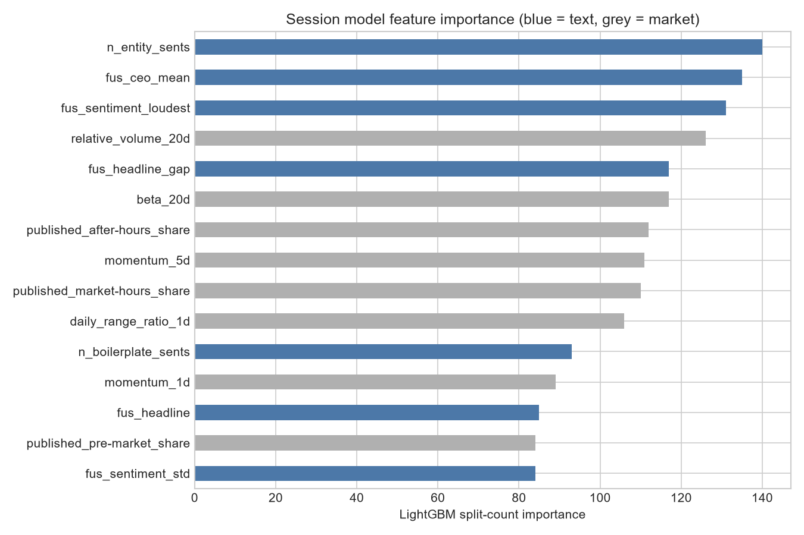
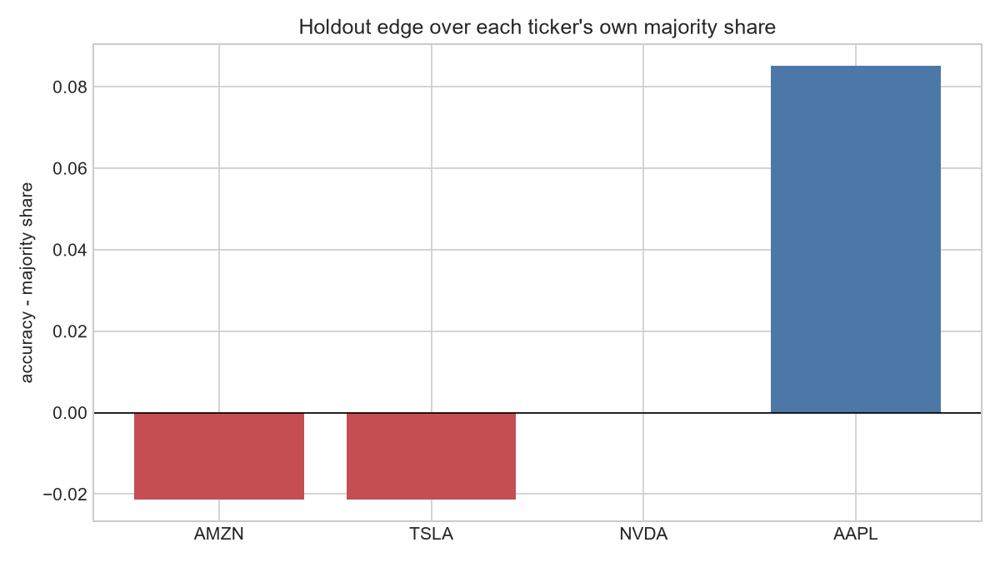
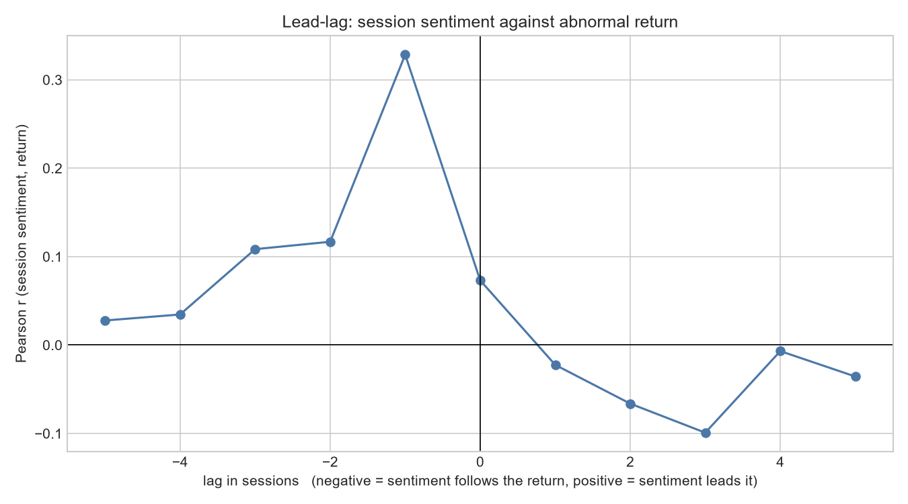

# Final findings

The project's decision record: the model that ships, the single holdout result that
justifies it, and every diagnostic behind that result. Generated by
`notebooks/modelling/4.0-kk-final-findings.ipynb`; numbers are that notebook's own run.
Where a reproduced value differs from `3.7`'s published one, both are given, because
`boosting_type="dart"` is not bit-reproducible across builds (see `3.9`).

This is the current published state of an ongoing project, not its endpoint. The size of
the signal, the backward-looking lead-lag, and the reactivity filter are limitations of
this iteration; each is a named next step under Future work below, not a closed result.

## The model

A single session-level LightGBM classifier on the pooled text-plus-market feature set,
tuned in `3.7`, no reactivity features. A combined model, not an ensemble: no ensemble
configuration placed in the top 15 of `3.7`'s search.

```
objective=binary, boosting_type=dart, num_leaves=31, learning_rate=0.08, min_child_samples=8, n_estimators=100, subsample=1.0, subsample_freq=3, colsample_bytree=0.5, reg_alpha=1.0, reg_lambda=5.0, max_depth=-1, is_unbalance=False
```

Trained through `market.evaluate.fit_final_model` on 36 features
(24 text, 12 market), aggregated from
41,298 article rows across 4 tickers
(AAPL, AMZN, NVDA, TSLA), 2025-08-31 to 2026-08-01, to
924 ticker-sessions.

## The result, on the locked holdout

The last fifth of sessions chronologically, 736 tuning rows against
188 holdout rows, matching `3.7`'s split exactly.

| metric | reproduced | 3.7 published |
|---|---|---|
| accuracy | 0.5798 | 0.5798 |
| majority baseline | 0.4309 | 0.4309 |
| edge | +0.1489 | +0.1489 |
| AUC | 0.6191 | 0.6191 |
| mcnemar_p | 0.0019 | 0.0019 |

Market-only reference on the same holdout: accuracy 0.5213,
edge +0.0904. The combined model is read against this, not
against 50 percent. Both sit inside `3.2`'s 53 to 57 percent band; 57.98 percent is a hair
over, not the 70 percent-plus that would mean a leak to go and find.

## The checks

**Feature importance.** Text carries 61.9% of total
importance, against 0.0 percent for the same architecture at article level (`3.6`). The
highest-ranked feature is `n_entity_sents`, the first text feature ranks
1 of 36, and the top five cover only
21.6%, spread rather than concentrated in a market handful.



**Regime fingerprint.** Market features alone tell the tuning and holdout pools apart at
80.6% against a 79.7% chance floor
(the pools are 736 against 188), a lift of about one point, nothing
like the 99.6 percent fold identification that condemned the article-level result.
Dropping the four features that carry that separation
(volatility_20d, beta_20d, momentum_20d, days_to_earnings) moves the edge from
+0.1489 to +0.1064 and `mcnemar_p` to
0.0176: real dependence, not collapse. The market cluster is doing
legitimate work on top of the text contribution, not standing in for a calendar.

**Per-ticker generalisation.** The pooled result does not transfer across companies. Each
ticker read against its own majority share:

| ticker | n | accuracy | majority share | edge |
|---|---|---|---|---|
| AAPL | 47 | 0.5957 | 0.5106 | +0.0851 |
| NVDA | 47 | 0.5745 | 0.5745 | +0.0000 |
| AMZN | 47 | 0.5532 | 0.5745 | -0.0213 |
| TSLA | 47 | 0.5957 | 0.6170 | -0.0213 |



The signal is carried by one company. The defensible claim is a real signal on at least one
ticker, not a firm-transferable one.

## The mechanism

Sentiment is mostly a reaction to price, not a lead on it. The lead-lag correlation peaks
at lag -1 (r = 0.328), sentiment against an
already-realised return, while the best predictive lag reaches only
r = -0.007.



`3.8` showed reactivity does not explain this: reactive and non-reactive articles both
correlate at r = 0.286 at lag -1, against a full-population 0.328.

## Reactivity

Left out of the shipped model. `3.9` added the three reactivity features to the winning
config and got a null with a small negative tilt (AUC 0.5995 to 0.5649, no holdout
prediction flipped). The features track market activity (`news_volume` r up to 0.37) but
sit at r = 0.02 to -0.03 against the return itself: they measure how much is happening, not
which direction, and the direction is the model's job. The regex filter also runs only 0.40
recall against the hand-labelled sample, so the question stays open pending a
recall-oriented classifier, but the feature does not earn a place in the model now.

## Future work: the next iterations

The three limitations above are the plan, not the verdict, and each is already scaffolded
by the layers this project has built.

1. **More data, more firms, more regimes.** The signal is real on AAPL and absent on the
   other three, on a corpus of four companies over one market trend. The direct
   continuation is breadth, more tickers across more sectors over more than one regime, so
   firm-transferability can be measured rather than inferred. Every layer is already
   ticker-agnostic, so this is collection and compute, not a redesign.
2. **A trained reactivity model, to resolve the lead-lag.** The backward-looking result is
   the reading of a weak regex filter (0.40 recall), not a settled fact. Replacing it with
   a supervised `is_reactive` classifier trained for recall and scored per entity is the
   route to separating reactive restatement from genuine forward-looking commentary, and so
   to isolating any predictive sentiment under the lag-1 correlation.
3. **Retune and re-test on the wider corpus.** With the data and the reactivity model in
   place, `3.7`'s search and every check above re-run: whether the AAPL signal spreads,
   whether an entity-scoped reactivity feature helps where the whole-article proxy did not,
   and whether isolating non-reactive sentiment turns the lag-1 reaction into a lead.

## The finding, at this stage

Article-level financial-news sentiment does not predict next-session abnormal returns on
these four tickers. Aggregated to the session it carries a real, significant, text-driven
signal on at least one of them (AAPL), on a signal that is largely a reaction to price
rather than a lead on it. That is what the repository ships now: the current state of an
ongoing project, with the next iterations set out above.
