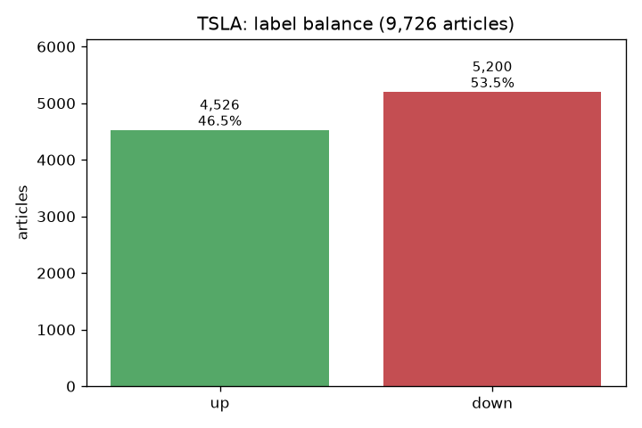
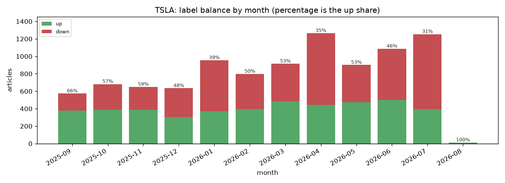
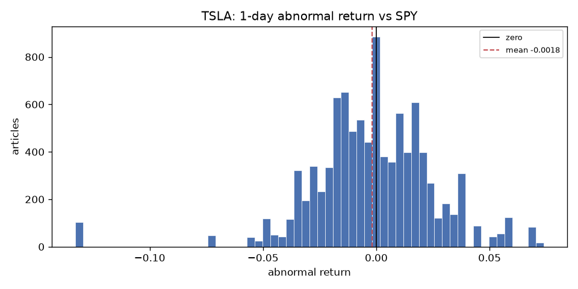
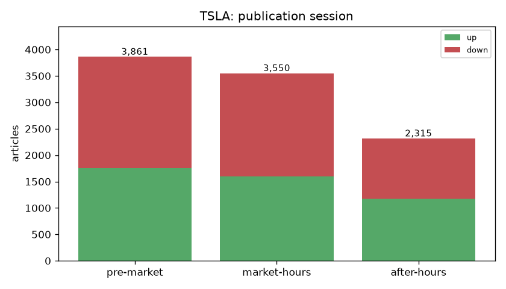
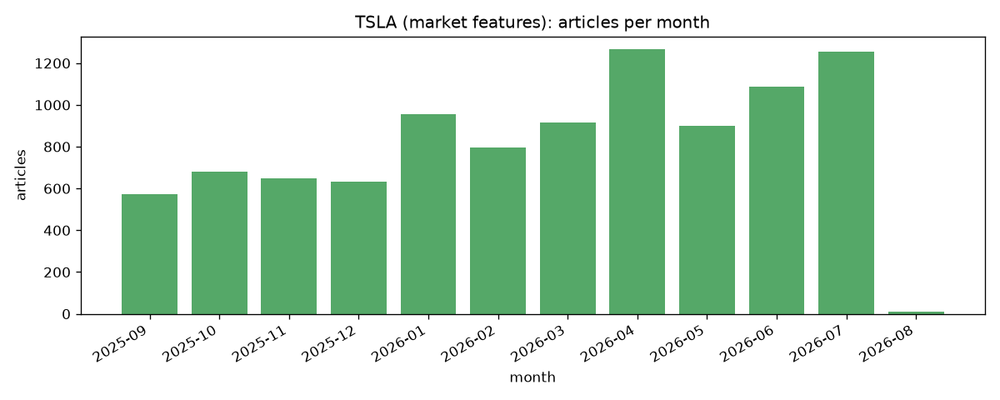
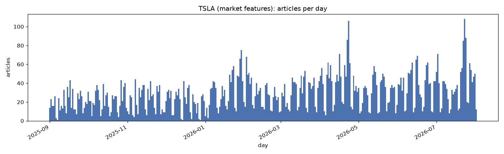
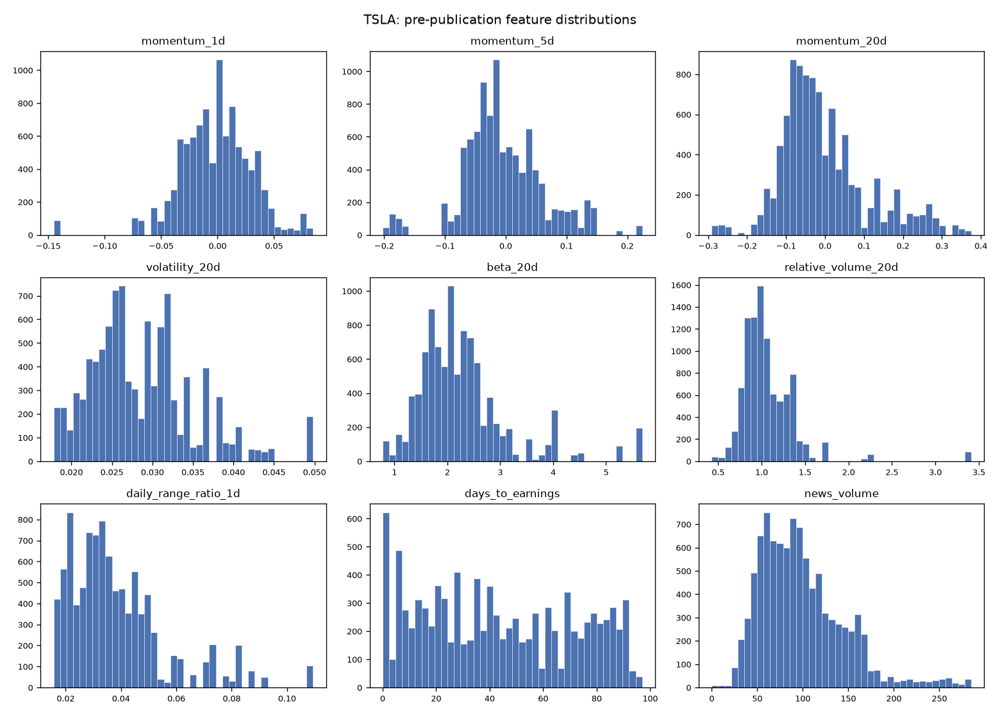

# TSLA: market feature table

One row per article: the label a model is trained against, and the market state as it stood at publication. Produced by `stock_predictor.market.run_pipeline`, which writes the table itself to `data/processed/market_run/TSLA/`. Joins the text layer's `article_features.parquet` on `article_id`.

**Rows:** 9,726 | **Columns:** 16 | **Span:** 2025-09-01 to 2026-08-01 | **Benchmark:** SPY

## The label

`label_direction` is the sign of the 1-day abnormal return: whether the target beat or trailed the benchmark over the session at or after publication. This is the column a classifier predicts, and the split below is the majority-class rate any model has to beat before it has shown anything at all.

| label | articles |
| --- | --- |
| up | 4,526 (46.5%) |
| down | 5,200 (53.5%) |
| flat or missing | 0 (0.0%) |
| majority-class rate | 53.5% |
| mean abnormal return | -0.0018 |
| std abnormal return | 0.0274 |

### Does that balance hold over time?

An overall split near even can hide months that run almost entirely one way. Those are the months a model can learn to recognise from market state alone and answer without reading the article, which is what notebook 3.2 found at 99.6% fold-identification accuracy. A wide spread here is a warning about the evaluation, not about the data.

| metric | value |
| --- | --- |
| months | 12 (1 under 100 articles, set aside below) |
| lowest monthly up-share | 31.4% (2026-07, 1,254 articles) |
| highest monthly up-share | 65.8% (2025-09, 573 articles) |
| spread | 34.4% |

### Where the label comes from

The abnormal return before it is reduced to a direction. A distribution centred off zero is a fact about the window rather than about any article, and it is what sets the majority class above.

## Publication session

Session decides which trading day an article is labelled against: pre-market articles anchor to that day's own session, market-hours and after-hours articles to the next one, sometimes across a weekend. A corpus concentrated in one session is a corpus whose labels are dominated by one alignment rule.

## Coverage over time

The population a price model actually joins against. Rows carrying no return are dropped, so a thin month here on a corpus the fetch report shows as steady means the market had no bar to label those articles against.

| metric | value |
| --- | --- |
| articles in corpus | 9,726 |
| labelled rows | 9,726 (100.0%) |
| date span | 2025-09-01 to 2026-08-01 (335 days) |
| active days | 335 of 335 (100.0%) |
| longest gap | 0 consecutive days with no article |
| articles/day | min 1, median 27, max 108 |

## Features

Every feature below is pre-publication by construction: `market.features` cuts each lookback at the article's calendar day rather than its timestamp, so the day's own close, which is not known until the bell, cannot enter a feature for an article published that morning. `abnormal_return_1d` and `label_direction` are the exception and are meant to be: they are the answer key, never an input.

`coverage` is the share of rows that are non-null. NaN means the window reached past the price history available, most often at the very start of the corpus.

| column | type | coverage | mean | std | description |
|---|---|---:|---:|---:|---|
| `abnormal_return_1d` | float64 | 100.0% | -0.002 | 0.027 | Target return minus benchmark return over the session at or after publication. The label. Deliberately forward-looking, the only column here that is. |
| `label_direction` | int64 | 100.0% | -0.069 | 0.998 | sign(abnormal_return_1d) as -1 / 0 / 1. 0 means the return was missing or exactly flat, so it is not a third class to predict. |
| `momentum_1d` | float64 | 100.0% | -0.002 | 0.032 | Cumulative return over the trading day before publication. |
| `momentum_5d` | float64 | 100.0% | -0.005 | 0.067 | Cumulative return over the 5 trading days before publication. |
| `momentum_20d` | float64 | 100.0% | -0.003 | 0.114 | Cumulative return over the 20 trading days before publication. |
| `volatility_20d` | float64 | 100.0% | 0.029 | 0.006 | Std dev of daily returns over the 20 trading days before publication. |
| `beta_20d` | float64 | 100.0% | 2.290 | 0.886 | Rolling 20-day beta of the target against the benchmark, before publication. |
| `relative_volume_20d` | float64 | 100.0% | 1.068 | 0.338 | Prior day's volume over its trailing 20-day median. |
| `daily_range_ratio_1d` | float64 | 100.0% | 0.038 | 0.018 | Prior day's high-low range, scaled by that day's close. |
| `days_to_earnings` | int64 | 100.0% | 43.038 | 28.295 | Calendar days to the next earnings date on or after publication. |
| `session` | object | 100.0% |  |  | Market session the article was published into: pre-market, market-hours, after-hours. |
| `news_volume` | int64 | 100.0% | 98.432 | 46.724 | Count of this ticker's own articles in the 3 days before publication. Scoped to one corpus, so it measures coverage intensity for this company rather than how busy the market was overall. |

## Reading the columns

- **`label_direction` has three values, not two.** 0 covers a missing or exactly flat return. Filter it out before training a binary classifier rather than letting it become a class.
- **`session` is categorical.** Cast it to a pandas `category` before handing it to LightGBM, or it is treated as text and dropped.
- **`news_volume` counts this ticker only.** Pooling tickers changes what it means, so re-derive it rather than summing across tables.
- **Rows here can be missing from the text table and vice versa.** The text layer drops articles that never mention the target; this layer drops articles with no market bar to label. An inner join on `article_id` is the intersection of both.
- **There is no 3-day label.** It was collected and examined, then dropped: notebook 3.0 found its columns carry close to no signal and 3.1 excluded them. Set `LABEL_HORIZONS_DAYS` in `config.py` to rebuild it.

The alignment convention is argued in `notebooks/market/1.1`, the feature definitions in `notebooks/market/1.4`.
