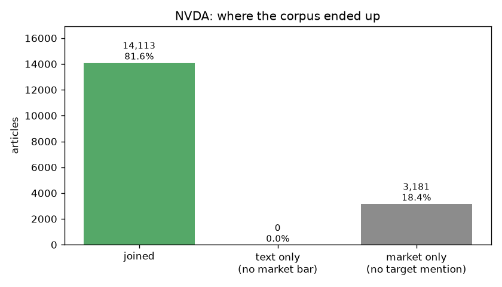
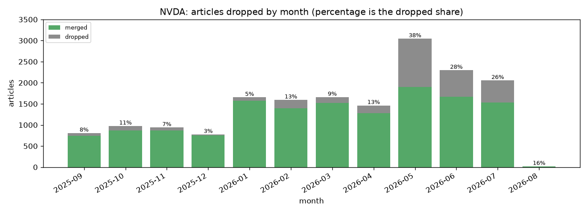
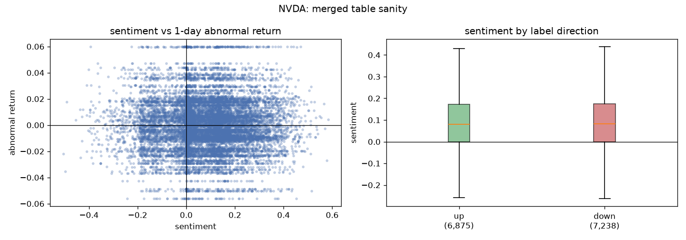

# NVDA: text-market merge

The two pipelines meet here. This report covers the join of `article_features.parquet` onto `market_features.parquet` on `article_id`, what it dropped, and whether the key and the features can still be trusted.

All checks passed.

**Merged rows:** 14,113 | **Columns:** 36 | **Span:** 2025-09-01 to 2026-08-01

## 1. Did the key hold?

`article_id` carries the whole join, so these run on every merge rather than being assumed. The third is the one that matters most: two tables can each hold unique ids and still disagree about what an id *means*, and a join across that disagreement pairs one article's sentiment with another article's return, which nothing downstream could detect.

| check | result | detail |
|---|---|---|
| article_id is unique within NVDA text features | **pass** | 14,113 rows, 14,113 distinct article_id |
| article_id is unique within NVDA market features | **pass** | 17,294 rows, 17,294 distinct article_id |
| one article_id means one article (text vs market) | **pass** | all 14,113 shared ids agree on timestamp_utc |
| every text id exists in the corpus | **pass** | all 14,113 ids found in the 17,294-article corpus |
| every market id exists in the corpus | **pass** | all 17,294 ids found in the 17,294-article corpus |

## 2. Is `momentum_1d` still leak-free?

Every feature must be computable at the moment the article was published. `momentum_1d` is reconstructed from raw OHLCV under both hypotheses and compared against the stored column:

- **leaky**: anchored to the article's own trading day, using a close that had not happened yet for any pre-market or market-hours article. This was a real bug; `reports/findings/momentum_1d-leakage-finding.md` documents it.
- **correct**: anchored to the day before, which is what `cumulative_return`'s `ref_date.normalize()` cutoff produces.

| metric | value |
| --- | --- |
| verdict | **pass** |
| rows tested | 17,294 |
| match the pre-publication formula | 17,294 (100.0%) |
| real leaks | 0 |
| undecidable | 2,552 (published on a non-trading day, where both formulas are arithmetically identical) |

By session, since the bug could only ever show up before a close:

| session | rows | match correct | real leaks | undecidable |
|---|---:|---:|---:|---:|
| after-hours | 4,323 | 4,323 (100.0%) | 0 | 2,528 |
| market-hours | 6,694 | 6,694 (100.0%) | 0 | 0 |
| pre-market | 6,277 | 6,277 (100.0%) | 0 | 24 |

## 3. What did not merge?

Two filters remove articles, and neither is a fault. The text layer drops articles that never mention the target; the market layer drops articles with no price bar to label against. A merged table smaller than expected for any other reason would show up as a failed check in section 1, not here.

| population | articles |
| --- | --- |
| corpus | 17,294 |
| text feature rows | 14,113 |
| market feature rows | 17,294 |
| merged | 14,113 |
| text rows that found a market partner | 14,113 of 14,113 (100.0%) |
| in text, not in market | 0 (no price bar to label against) |
| in market, not in text | 3,181 (no mention of NVDA in body or headline) |

Dropped articles should be spread across the corpus. A month losing far more than its neighbours points at something that failed for a stretch, a rate-limited scrape or a gap in price history, rather than at a filter doing its job.

## 4. Does the merged table look like data?

A weak relationship between sentiment and return is the expected result and not the point of this section. The point is that a mis-paired join produces no relationship at all: identical boxes and a structureless scatter. These are read as a merge check, never as a finding.

| metric | value |
| --- | --- |
| rows with both scores | 14,113 |
| correlation, sentiment vs return | +0.0011 |
| mean sentiment, up articles | +0.0804 |
| mean sentiment, down articles | +0.0821 |
| difference | -0.0017 |

## 5. Shared articles

Finnhub returns one story for every ticker it mentions, so an article about several companies appears in several corpora. Those rows carry the same text but different sentiment, scored toward a different target, and a different company's return as the label. They are genuinely different training examples, which is why the pooled table is keyed on `(article_id, ticker)` and never on `article_id` alone.

This is also the contamination a cross-firm transfer test has to exclude: training on NVDA and testing on a ticker below means the model has already seen that share of the test text.

| also appears under | shared articles | share of this table |
|---|---:|---:|
| AMZN | 1,633 | 11.6% |
| AAPL | 1,408 | 10.0% |
| TSLA | 1,135 | 8.0% |

## Reading this table

- **Join key.** `article_id` is unique here. In the pooled table it is not; the key there is `(article_id, ticker)`.
- **`label_direction` has three values.** 0 covers a flat or missing return. Filter it out before training a binary classifier.
- **`session` is categorical.** Cast it to a pandas `category` before handing it to LightGBM.

Column definitions live with the layers that produce them: `reports/market/{ticker}_market_features_report.md` for the market columns, `data/processed/pipeline_run/{ticker}/article_features.md` for the text ones.
